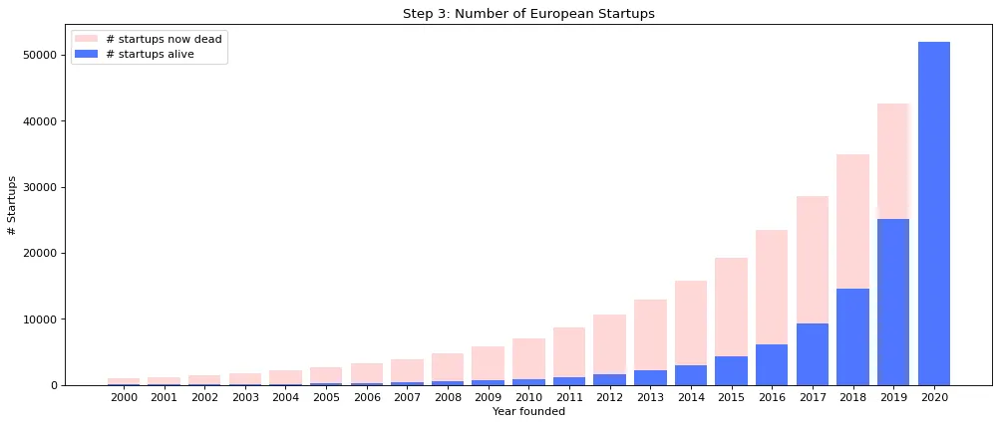
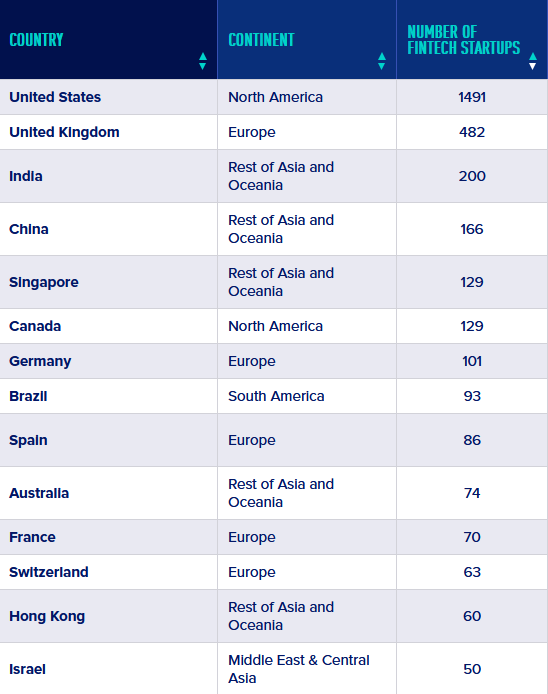

# Compass market resource

Estimate of the yearly number of founded startups in Europe by accounting for 22% growth, as shown in the graph abow. 

(If we define startup as follows:
- it’s a product-based company (no agencies or consultancies)
- its core business is enabled by technology (i.e. e-commerce is ok)
- it’s younger than 20 years)

### Key Statistics
-    20% of new businesses fail within the first two years.
-    45% of new business startups don’t survive the fifth year.
-    65% of new startups fail during the first ten years.
-    75% of American startups go out of business during the first 15 years.

### Startup Success Rates
Generally, new business success rates are around 10% to 20% over the long term. However, many factors determine potential startup success.

### Key Statistics

-    34% of startup failures are due to a poor product-market fit.
-    22% of failed businesses didn’t implement the correct marketing strategies.
-    18% of startups fail due to team problems and other human-resource-related issues.
-    16% of failures in the startup world are the result of cash flow problems and other financial issues.
-    6% of startup failures are due to tech-related problems, including poor cyber security and outdated solutions.
-    2% of startups fail due to sub-optimal operations.
-    2% of startups fail due to legal problems, such as issues with licensing, registering an unsuitable entity structure, and failing to formulate a partnership agreement that protects the interests of each co-founder.

By calculating those data, in 2024 over 39k startup falis due to poor product market only in Europe. 

 
The US and UK, India, China, Canada, Singapore, and Germany each have more than active 100 FinTech startups, and Brazil is not far behind.

# Conclusion
Europe launches only about 20-25% of the startups globally, meaning that around 200,000 startups fail due to a lack of market demand assessment in 2024. This number is expected to increase by approximately 20% each year.

Furthermore, our target users are not only those who fail due to a lack of market assessment but also those who don't even start their business, either knowing the high failure rate of startups or simply because starting one seems too complex.

#### Sources:
- https://explodingtopics.com/blog/startup-failure-stats
- https://medium.com/glassdollar/estimating-the-number-of-startups-in-europe-5d28286307f8
- https://businessfinancing.co.uk/fintech-startups-mapped/
